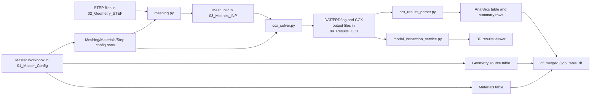

# Sonotrode Design GUI Pipeline Documentation

## Index

- [1. Project Overview](#1-project-overview)
- [2. Architecture Summary](#2-architecture-summary)
- [3. Repository Structure](#3-repository-structure)
- [4. Dependencies And Runtime Requirements](#4-dependencies-and-runtime-requirements)
- [5. Full User Guide](#5-full-user-guide)
- [6. Module Reference](#6-module-reference)
- [7. Detailed Meshing Pipeline](#7-detailed-meshing-pipeline)
- [8. Detailed CCX Pipeline](#8-detailed-ccx-pipeline)
- [9. Detailed Post-Processing & Mode Selection](#9-detailed-post-processing--mode-selection)
- [10. Workbook Sheet Reference](#10-workbook-sheet-reference)
- [11. Outputs And Metrics](#11-outputs-and-metrics)
- [12. Troubleshooting](#12-troubleshooting)
- [13. Known Limits And Notes](#13-known-limits-and-notes)
- [14. Source Of Truth Matrix](#14-source-of-truth-matrix)

## 1. Project Overview

Sonotrode Designer is a PySide6 desktop application for a SolidWorks-driven sonotrode workflow. It turns a design workbook and exported STEP files into meshed CalculiX jobs, then converts solver outputs into ranked modal metrics for inspection and reporting.

The practical flow is:

1. Prepare CAD configurations in SolidWorks.
2. Export one STEP file per configuration.
3. Load the project workbook in the Qt GUI.
4. Mesh STEP files into Abaqus INP decks.
5. Run CalculiX frequency solves.
6. Parse DAT/FRD outputs into job-table metrics.
7. Inspect trends in 2D/3D plots and modal deformation views.

The codebase is intentionally separated into view, controller, model/state, and engineering services so the GUI stays thin and the numerical workflow remains testable.

## 2. Architecture Summary

The application follows an explicit MVC-style architecture with a lightweight composition root.

### View

- `scripts/MainWindow.ui` defines the Qt widget tree and visual layout.
- The runtime plot canvases and 3D viewports created in `scripts/main.py` are also part of the presentation layer.
- View code does not own workflow logic; it only exposes widgets, signals, and render targets.

### Controller

- `scripts/app/controllers/base_controller.py` provides the shared `AppContext` and controller wiring.
- `scripts/app/controllers/setup_controller.py` handles project creation/loading, workbook augmentation, geometry selection, semantic role assignment, and batch solve orchestration.
- `scripts/app/controllers/analytics_controller.py` manages job-table refresh, selected-model mesh/solve actions, charting, hover interaction, and report export.
- `scripts/app/controllers/results_controller.py` manages result-row selection, mode navigation, warp control, and 3D playback.

### Model

- `scripts/app/state/project_session.py` is the central application model/state object.
- It stores project paths, workbook DataFrames, table models, semantic roles, result-selection state, cached mode metadata, and active worker references.
- Qt-facing tabular data is exposed through `scripts/analytics_table_model.py`, which bridges DataFrames to the analytics table view.

### Engineering Services and Execution Adapters

- `scripts/meshing.py`, `scripts/ccx_solver.py`, `scripts/ccx_results_parser.py`, `scripts/modal_inspection_service.py`, `scripts/analytics_service.py`, and `scripts/augment_master_workbook.py` implement the domain logic and file transforms used by the GUI.
- `scripts/app/workers/mesh_worker.py` and `scripts/app/workers/solver_worker.py` are asynchronous execution adapters. Controllers invoke them to keep long-running work off the GUI thread.
- `scripts/app/workers/stream_redirect.py` routes stdout/stderr into the GUI console.

### Composition Root

- `scripts/main.py` is the assembly point. It loads the UI, creates the `ProjectSession`, builds the `AppContext`, instantiates controllers, connects timers and stream redirection, and exposes the top-level window.

This structure keeps presentation concerns in the view, user interaction in controllers, data/state in the model, and numerical/file-processing work in services and workers.

## 3. Repository Structure

```text
environment.yml
scripts/
  main.py
  MainWindow.ui
  analytics_service.py
  analytics_table_model.py
  augment_master_workbook.py
  ccx_results_parser.py
  ccx_solver.py
  meshing.py
  modal_inspection_service.py
  solidworks_step_export.bas
  STEP_batch_generator.swp
  app/
    controllers/
      base_controller.py
      setup_controller.py
      analytics_controller.py
      results_controller.py
    state/
      project_session.py
    workers/
      stream_redirect.py
      mesh_worker.py
      solver_worker.py
    widgets/
      tetris_engine.py
      tetris_popup.py
      tetrix.py
```

## 4. Dependencies And Runtime Requirements

### Python environment

The environment is defined in `environment.yml`.

Recommended setup:

```powershell
mamba env create -f environment.yml
conda activate sonotrode_lab
python scripts/main.py
```

### Core libraries

- `PySide6` for the desktop GUI.
- `gmsh` and `meshio` for STEP meshing and INP conversion.
- `pandas` and `openpyxl` for workbook and report handling.
- `matplotlib` for analytics plots.
- `pyvista` and `pyvistaqt` for 3D setup/results inspection.
- `numpy` and `scipy` for numerical processing.

### External executable requirements

- CalculiX (`ccx` or `ccx.exe`) must be discoverable through `PATH` or the active environment.
- SolidWorks is required for CAD/configuration editing and STEP export macro execution.
- Excel automation is used by the SolidWorks macro to read and select the master workbook.

## 5. Full User Guide

### 5.1 SolidWorks workflow (external, before GUI)

This section comes first because the GUI workflow starts only after the workbook and STEP files exist.

1. Open the target part in SolidWorks.
2. Ensure the part has the intended configurations.
3. Ensure the paired workbook exists and contains the geometry/design-table source rows.
4. Run the STEP batch macro.

Important repository note:

- `scripts/solidworks_step_export.bas` is the editable source version in this repository.
- `scripts/STEP_batch_generator.swp` is the SolidWorks macro container.
- If `.bas` is modified, mirror that code into the `.swp` macro through the SolidWorks macro editor.

Macro behavior implemented in `solidworks_step_export.bas`:

- Resolves workbook path with priority:
  1. explicit override,
  2. `<part-folder>/<part-name>.xlsx`,
  3. nearby `01_Master_Config` heuristics,
  4. Excel file picker fallback.
- Resolves export folder with priority:
  1. explicit override,
  2. existing project-like STEP folder (`02_Geometry_STEP` preferred),
  3. user folder prompt fallback.
- Detects geometry sheet and configuration column robustly, including design-table style headers.
- Exports one `.step` per active configuration row.
- Uses optional columns:
  - `model_name` for filename override,
  - `enabled` for per-row include/exclude.

### 5.2 Create or load a GUI project

1. Launch with `python scripts/main.py`.
2. Use the Setup tab:
   - `Create new project`, or
   - `Load Project` and select the workbook.
3. Standard folders are created or expected:
   - `01_Master_Config`
   - `02_Geometry_STEP`
   - `03_Meshes_INP`
   - `04_Results_CCX`
   - `05_Reports`

### 5.3 Workbook augmentation

If the workbook lacks simulation sheets, click `Augment Workbook`.

`augment_master_workbook.py` ensures:

- `Meshing_Parameters`
- `Materials`
- `Step_Configuration`
- `Materials_Library`
- `Instructions`

Header aliases are normalized, for example `Density` becomes `Density_kg_m^3` and `Youngs_modulus` becomes `Youngs_modulus_GPa`.

### 5.4 STEP preview and semantic roles

1. Select a geometry from the Setup list.
2. The GUI loads a Gmsh-generated preview mesh (`temp_ref.vtk`).
3. Pick a face in 3D.
4. Assign a role from the combo box (`Tip - "YMAX"`, `Base - "YMIN"`, etc.).

Selection handling supports multiblock-style picks and derives surface normals from extracted surface data when available.

### 5.5 Batch run (Setup tab)

`Run` triggers `SolverWorker` over the full project STEP set.

Per model, the worker does:

1. Mesh generation using the workbook row configuration.
2. CCX solve via `solve_frequency_case`.
3. Fallback remesh and retry with `Element_order=1` when the CCX output contains `nonpositive jacobian`.
4. DAT parsing for summary metrics.

`Abort` requests worker cancellation and active CCX process termination.

### 5.6 Selected operations (Analytics tab)

From selected table rows:

- `Mesh Selected Items` runs `MeshGenerationWorker` only for the selected models.
- `Run CCX` toggles to `Abort CCX` while running, uses `CCXSolverWorker` on selected models, and respects CPU hints from `Step_Configuration` or mesh configuration when provided.

### 5.7 Analytics refresh and plotting

The job table is rebuilt from disk artifacts.

Status logic:

- `Pending`: no mesh INP exists.
- `Meshed`: mesh INP exists but FRD does not.
- `Solved`: mesh INP and FRD both exist.

For solved rows, DAT is parsed for modal metrics.

Plotting behavior:

- X/Y/Z dropdowns are populated from numeric table columns.
- Z set to `--- None (2D) ---` gives a 2D scatter plot.
- Non-empty row selection is highlighted and connected by an orange dashed path.
- Hover tooltip shows `Model_name (X;Y)` or `Model_name (X;Y;Z)`.

Press `F5` to refresh the Setup list and Analytics table from disk when no mesh or CCX worker is active.

### 5.8 Results tab (3D inspection)

1. Select a results table row.
2. `Render 3D` or `Load 3D`:
   - if the row status is `Solved`, load FRD mode vectors,
   - if the row status is `Meshed`, load boundary-node preview only.
3. Use the warp slider for deformation scale.
4. Use previous/next mode navigation.
5. `Make it move!` toggles sinusoidal animation over the slider range.

Modal data is read from FRD by explicit mode-block parsing and mapped back to INP node indexing.

### 5.9 Export summary

`Export table to Excel` writes to `05_Reports/<name>.xlsx`.

Column order:

1. Current UI table columns.
2. Remaining geometry columns.
3. Remaining material columns.

Header color groups:

- simulation/core: blue,
- geometry: yellow,
- material: green.

### 5.10 Optional mini-game

The `Tetris!` button opens `app/widgets/tetris_popup.py` during active solve runs.

## 6. Module Reference

### `scripts/main.py`

- Thin composition root for the GUI application.
- Loads the Qt Designer UI.
- Creates `ProjectSession`, `AppContext`, controllers, timers, stream redirection, and the refresh shortcut.

### `scripts/MainWindow.ui`

- Qt widget layout for the full desktop interface.
- Defines the tabs, tables, buttons, plotting frames, labels, and 3D view placeholders used by the controllers.

### `scripts/app/state/project_session.py`

- Central application model/state container.
- Stores project paths, workbook DataFrames, current selections, cached mode metadata, and active worker references.
- Resets project-scoped state without destroying the main window.

### `scripts/app/controllers/base_controller.py`

- Shared controller base class.
- Provides access to the main window, UI, session, widgets, and controller registry through `AppContext`.

### `scripts/app/controllers/setup_controller.py`

- Handles project creation/loading and workbook loading.
- Owns workbook augmentation, geometry list population, semantic role assignment, amplitude assignment, and batch-run orchestration.
- Starts the long-running batch worker and manages abort UI state.

### `scripts/app/controllers/analytics_controller.py`

- Rebuilds the job table from disk.
- Orchestrates selected-model mesh-only and CCX-only actions.
- Manages charting, hover tooltips, row highlighting, and Excel export.
- Consumes `select_longitudinal_mode` output to populate modal summaries.

### `scripts/app/controllers/results_controller.py`

- Drives the results tab.
- Loads selected mesh or solved results into the 3D view.
- Manages warp scale, mode navigation, and animation playback.

### `scripts/app/workers/mesh_worker.py`

- Background worker for selected-model mesh generation.
- Calls the meshing service from a non-GUI thread and emits progress/status updates.

### `scripts/app/workers/solver_worker.py`

- Background worker for the full meshing plus CCX batch pipeline.
- Performs mesh generation, solver execution, fallback remeshing, and post-solve parsing hooks.

### `scripts/app/workers/stream_redirect.py`

- Qt-compatible stdout/stderr bridge.
- Streams console output into the GUI.

### `scripts/analytics_service.py`

- Loads the geometry source sheet from the master workbook.
- Normalizes `Model_name` values and filters invalid rows.

### `scripts/analytics_table_model.py`

- Qt table model wrapper around the analytics DataFrame.
- Bridges the DataFrame representation to the table view.

### `scripts/augment_master_workbook.py`

- Adds missing simulation sheets to the master workbook.
- Creates template rows and normalizes legacy material headers.

### `scripts/meshing.py`

- Converts STEP geometry into Gmsh meshes and Abaqus INP decks.
- Assigns physical groups, exports surface sets, and handles fallback Y-extrema selection.

### `scripts/ccx_solver.py`

- Builds the CalculiX frequency deck.
- Normalizes the mesh deck, resolves the CCX executable, launches solver jobs, and exposes the batch worker APIs.

### `scripts/ccx_results_parser.py`

- Parses INP node sets, DAT modal output, and modal displacement vectors.
- Selects the longitudinal mode using a dimensionless fitness score and constructs summary rows for the analytics table.

### `scripts/modal_inspection_service.py`

- Loads FRD and INP data for 3D inspection.
- Extracts available modes, loads displacement vectors for a selected mode, and computes warp/visibility helpers.

### `scripts/solidworks_step_export.bas`

- Source macro code for STEP export from SolidWorks.
- Resolves workbook and output folders and exports one STEP file per enabled configuration.

### `scripts/STEP_batch_generator.swp`

- SolidWorks macro container used to package the STEP export workflow.

### `scripts/app/widgets/tetris_engine.py`, `tetris_popup.py`, `tetrix.py`

- Optional UI mini-game and its supporting implementation.
- These widgets are not part of the engineering pipeline but are wired into the GUI for user interaction during long solves.

## 7. Detailed Meshing Pipeline

1. Input STEP is loaded with OCC and synchronized.
2. Semantic role centroid matching attempts physical surface assignment.
3. Missing essentials are inferred from global Y extrema (`YMAX`/`YMIN`).
4. Volume physical group `Volume1` is created.
5. Mesh is generated in 3D and optimized (`Netgen`; optional high-order optimize).
6. The `.msh` file is converted to Abaqus INP using volume cells only.
7. Surface physical sets are converted to NSET blocks and filtered to nodes used in volume elements.

Important behavior:

- If second-order elements are requested but absent in the generated volume cells, meshing raises an explicit error.

## 8. Detailed CCX Pipeline

1. The mesh INP is normalized:
   - node lines are normalized,
   - `ELSET=Volume1` is guaranteed when missing.
2. Material values are read from the workbook row, with legacy alias support.
3. A frequency step is generated. The current runtime workflow supports frequency analysis.
4. Output sets and variables are applied:
   - defaults: `YMIN,YMAX` and `U`.
5. Missing output NSETs can be synthesized from Y-extrema node coordinates.
6. CCX is launched with `-i <base_name>` in `04_Results_CCX`.
7. The worker emits parseable status messages (`SOLVE|...`) for table refresh and console logging.

After the solve:

- DAT is parsed for modal metrics.
- FRD is used for solved-state detection and 3D mode inspection.

## 9. Detailed Post-Processing & Mode Selection

After CCX finishes, the post-processing path no longer trusts raw mass-normalized amplitudes to choose the longitudinal mode. That would bias selection toward floppy bending-dominated shapes that happen to have large displacements but poor axial purity. Instead, `select_longitudinal_mode` in `ccx_results_parser.py` ranks each mode with a dimensionless fitness score built from axial participation, uniformity, and phase relationship.

The selector evaluates the tip and base separately, then combines their scores into one ranking value. The raw amplitudes are still preserved for reporting, but they do not drive the mode choice directly.

### Axial Participation Fraction ($R_a$)

Evaluates purity of motion along the Y-axis.

$$
R_a = \frac{|U_y|}{\sqrt{U_x^2 + U_y^2 + U_z^2}}
$$

### Uniformity Penalty ($R_u$)

Evaluates face warping/tilting via standard deviation ($\sigma$).

$$
R_u = \frac{\sigma_y}{|U_y|}
$$

### Dimensionless Fitness Score

$$
\text{Score} = R_{a,\text{tip}} \times R_{a,\text{base}} \times \exp(-3.0 \cdot R_{u,\text{tip}}) \times \exp(-3.0 \cdot R_{u,\text{base}}) \times P
$$

Where $P = 1.2$ if the tip and base move exactly out-of-phase ($(U_{y,\text{tip}} \cdot U_{y,\text{base}}) < 0$), and $P = 1.0$ otherwise.

Implementation notes:

- The parser computes tip and base axial participation from the full displacement vector, not from a single component ratio.
- The uniformity penalty uses the standard deviation of Y displacement relative to the mean Y displacement on each face.
- The mode with the highest score is selected as the longitudinal mode.
- Once selected, the mode is rescaled to the requested input amplitude for reporting.
- The ranked list is preserved in `_all_ranked_modes` and forwarded through `_Ranked_Metrics` for traceability.

## 10. Workbook Sheet Reference

### Geometry source sheet (first workbook sheet)

Expected convention in `analytics_service.py`:

- row 2: headers,
- row 4 onward: data,
- first column interpreted as `Model_name`.

Rows with blank, `nan`, or default model names are filtered out.

### `Meshing_Parameters`

Fields used in the current code path:

- `Model_name`
- `Element_order`
- `Characteristic_length_min`
- `Characteristic_length_max`
- `Second_order_incomplete`
- `Num_threads` (optional)

`Algorithm`, `Recombine`, and `Msh_version` are created by the augmentation template but are not currently consumed in `meshing.py`.

### `Materials`

Fields used:

- `Model_name`
- `Density_kg_m^3` (or legacy aliases)
- `Youngs_modulus_GPa` (or legacy aliases)
- `Poissons_ratio`

### `Step_Configuration`

Fields used:

- `Model_name`
- `Step_type` (`frequency` supported)
- `Number_of_frequencies`
- `Lower_frequency_hz`
- `Upper_frequency_hz`
- `Output_nsets`
- `Output_variables`

Optional fields used when present:

- `Constrained_nset`
- `Constrained_dofs` (CSV DOF list 1..6)
- `Num_threads` or `Num_cpus` (CPU hints)

### `Materials_Library`

Reference sheet created for convenience; not consumed by the runtime pipeline.

### `Instructions`

Generated helper text sheet; not consumed by the runtime pipeline.

## 11. Outputs And Metrics

### Primary generated files

- Meshes: `03_Meshes_INP/*_mesh.inp`
- Fallback meshes, when used: `03_Meshes_INP/*_mesh_fallback_o1.inp`
- Solver decks, logs, and results: `04_Results_CCX/*.inp`, `*.log`, `*.dat`, `*.frd`, plus CCX side files such as `*.sta` and `*.cvg`
- Exports: `05_Reports/*.xlsx`

### Canonical summary metrics

- `Number_of_nodes`
- `Mode_Index`
- `Frequency_Hz`
- `YMAX_Mean`
- `YMIN_Mean`
- `Gain_Ratio`
- `Tip_Std`
- `Base_Std`

Metric derivation from the parser:

- `Gain_Ratio = |YMAX_Mean / YMIN_Mean|`, guarded for near-zero base displacement.
- `Tip_Std` and `Base_Std` come from the selected mode's displacement statistics and are scaled into micrometers for reporting.
- The parser also retains `_Ranked_Metrics` internally so the chosen mode can be traced back to the full ranked list.

## 12. Troubleshooting

- No STEP files listed in Setup:
  - Verify files are in `02_Geometry_STEP` with `.step` or `.STEP` extension.

- Workbook configuration not loading:
  - Keep exactly one workbook in `01_Master_Config` when relying on auto-detection.
  - Remove temporary lock files and ensure required sheets exist.

- Solve fails with executable not found:
  - Ensure `ccx` or `ccx.exe` is discoverable in the active environment or `PATH`.

- Solve fails due to Jacobian:
  - The batch worker automatically retries with a first-order fallback mesh.
  - Inspect the generated fallback mesh deck and geometry quality.

- Table shows `Meshed` but not `Solved`:
  - Verify `.frd` exists in `04_Results_CCX` for that model.

- Metrics missing on a solved model:
  - Verify `.dat` exists and contains parseable modal blocks for the requested sets.

- 3D result load fails:
  - Verify matching mesh INP and FRD filenames (`<Model_name>_mesh.inp`, `<Model_name>.frd`).

- OpenGL viewports unavailable:
  - Validate the local Qt/OpenGL/PyVista stack.

- Unexpected longitudinal mode selection:
  - The selector prefers axial purity and uniformity, not the largest raw amplitude.
  - Check whether the tip and base are actually moving along Y and whether they are close to out-of-phase.

## 13. Known Limits And Notes

- Runtime status is file-system-driven and assumes naming consistency by model stem.
- Solver deck generation currently supports frequency steps only.
- Geometry enrichment assumes the first workbook sheet follows the SolidWorks row convention used by `analytics_service.py`.
- Setup geometry list accepts `.step` and `.STEP`; analytics model discovery also includes `.stp` and `.STP`.
- Some UI behavior depends on expected widget names in `MainWindow.ui`.
- The longitudinal-mode selector assumes the engineering axis of interest is the Y-axis.

## 14. Source Of Truth Matrix

### Source-of-truth flow



### Practical ownership map

- Workbook rows define the simulation configuration.
- STEP files define the input geometry set.
- `meshing.py` owns STEP-to-INP conversion.
- `ccx_solver.py` owns deck generation and solver launch.
- `ccx_results_parser.py` owns modal ranking and summary metric extraction.
- `modal_inspection_service.py` owns interactive 3D playback for solved models.
- Controllers own UI state transitions and decide when each service is invoked.
